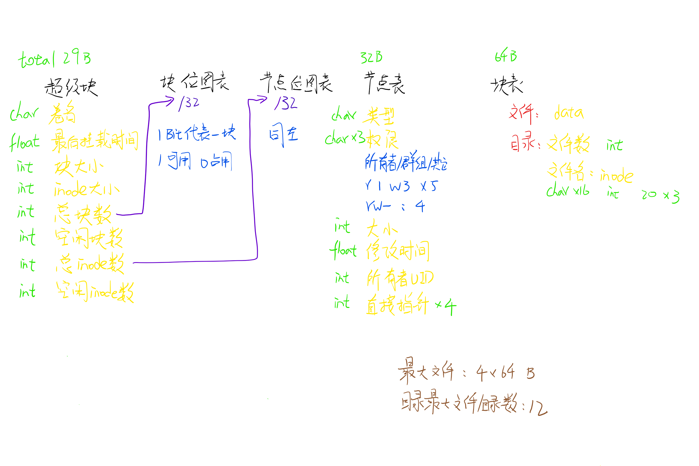

# 操作系统实验和课程设计

## experiment 实验部分
    5states 模拟5状态转换
    page_replacement 模拟页面置换
    PS 消费者/生产者同步问题
    # ~ 没啥好食用的，就酱 ~
  
## curriculum design 课程设计 （未完成）
  - 题目 unix文件系统模拟
  - 初步构想
    - 大致结构
        - kernel 模拟内核的基本文件读写操作（增删读写文件，虚拟硬盘的格式化挂载等）
        - command line 用户黑框界面 （输入检测，输出结果，用户登录）
        - Main 程序入口，抽象的电源按键 （新用户新黑窗）
        - Setting 保存超参数
        - VirtualDiskVisualization 虚拟硬盘文件的可视化工具，用于辅助测试 *什么？我们竟然有测试？*
        - KernelTest 简单unitest测试
        
    - 初步文件系统结构设计
          
          
    - 内核
        - 通过from Kernel import kernel调用内核
        - 注意：此时**kernel**为内核的**实例**的单例化形式，非类名  ！k为小写！
        - 提供的接口
            - [x] 添加文件或目录 add_directory_or_file(directory, data=None)
                - directory: 要添加的完整路径 对于目录来说，形如/etc/psw/ **目录末尾的‘/’** 文件 /etc/psw/psw.txt
                - data: 对于文件来说，这是文件的内容 目录无此参数 类型为**bytes**
            - [ ] 删除目录或文件 remove_directory_or_file()
            - [ ] 读取目录 read_directory()
            - [ ] 读取文件 read_file()
            - [x] 关闭内核 shut_down()
                - **！重要！在关闭前必须执行此操作，否则可能会导致虚拟硬盘文件未关闭或缓冲数据未写入文件的问题**
  - todo
    - 读取文件/目录 内容
    - 删除文件/目录